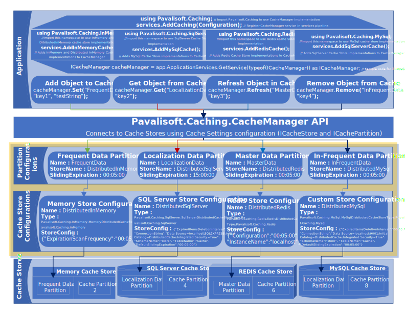

# Caching
[Pavalisoft.Caching](https://www.nuget.org/packages/Pavalisoft.Caching/) is an open source caching extension for .NET Standard written in C#, which provides single unified API for both [MemoryCache](https://docs.microsoft.com/en-us/aspnet/core/performance/caching/memory?view=aspnetcore-2.2) and [DistributedCache](https://docs.microsoft.com/en-us/aspnet/core/performance/caching/distributed?view=aspnetcore-2.2) implementations.

The main goal of the [Pavalisoft.Caching](https://www.nuget.org/packages/Pavalisoft.Caching/) package is to make developer's life easier to handle even very complex caching scenarios and concentrate on functionality. It's additional feature [CacheManager](https://pavalisoft.github.io/Caching/class_pavalisoft_1_1_caching_1_1_cache_manager.html) supports various cache providers and implements many advanced features which can be used in single project/application.

With [Pavalisoft.Caching](https://www.nuget.org/packages/Pavalisoft.Caching/), it is possible to implement multiple layers of caching with multiple cache providers in one place, e.g. [MemoryCache](https://docs.microsoft.com/en-us/aspnet/core/performance/caching/memory?view=aspnetcore-2.2) and [DistributedCache](https://docs.microsoft.com/en-us/aspnet/core/performance/caching/distributed?view=aspnetcore-2.2), in just a few lines of code.

The below diagram explains the [Pavalisoft.Caching](https://www.nuget.org/packages/Pavalisoft.Caching/) API and its usage.

## Documentation
Refer https://pavalisoft.github.io/Caching/ for [Pavalisoft.Caching](https://www.nuget.org/packages/Pavalisoft.Caching/) API documentation

## Usage

1. Define the [Cache Stores](https://pavalisoft.github.io/Caching/class_pavalisoft_1_1_caching_1_1_cache_settings.html#abacbfb422d22fd66190f2350901b8797) and [Partitions](https://pavalisoft.github.io/Caching/class_pavalisoft_1_1_caching_1_1_cache_settings.html#a132238e26cb3fd3005fb2ebdcc36a36f) in Caching configuration section in appSettings.json

`	"Caching": {
		"Stores": [
		  {
			"Name": "DistributedInMemory",
			"Type": "Memory",
			"StoreConfig": "{\"ExpirationScanFrequency\":\"00:05:00\"}"
		  },
		  {
			"Name": "DistributedSqlServer",
			"Type": "SqlServer",
			"StoreConfig": "{\"ExpiredItemsDeletionInterval\":\"00:05:00\", \"ConnectionString\":\"Data Source=localhost\SQLEXPRESS;Initial Catalog=DistributedCache;Integrated Security=True\", \"SchemaName\":\"store\", \"TableName\":\"Cache\", \"DefaultSlidingExpiration\":\"00:05:00\"}"
		  },
		  {
			"Name": "DistributedRedis",
			"Type": "Memory",
			"StoreConfig": "{\"Configuration\":\"00:05:00\", \"InstanceName\":\"localhost\"}"
		  }
		],
		"Partitions": [
		  {
			"Name": "FrequentData",
			"StoreName": "DistributedInMemory",
			"SlidingExpiration": "00:05:00"
		  },
		  {
			"Name": "LocalizationData",
			"StoreName": "DistributedSqlServer",
			"Priority": "NeverRemove"
		  },
		  {
			"Name": "MasterData",
			"StoreName": "DistributedRedis",
			"SlidingExpiration": "00:05:00"
		  }
		]
	  }
`

2. Add [Pavalisoft.Caching](https://www.nuget.org/packages/Pavalisoft.Caching/) to services

`        public void ConfigureServices(IServiceCollection services)
        {
            ...
            services.AddCaching(Configuration); 
            ...
        }
`

3. Use [CacheManager](https://pavalisoft.github.io/Caching/class_pavalisoft_1_1_caching_1_1_cache_manager.html) methods to add, get, refresh and remove items in Cache.

`	// Add required using statements
	using Pavalisoft.Caching;
	using Pavalisoft.Caching.Interfaces;
	using Microsoft.Extensions.Primitives;
	using System;

	namespace Pavalisoft.Caching.Sample
	{
		public class CachingSample
		{
			private const string CachePartitionName = "FrequentData";		
			private readonly ICacheManager _cacheManager;
			public CachingSample(ICacheManager cacheManager)
			{
				_cacheManager = cacheManager;
			}

			public AppUser GetAppUser(HttpContext httpContext)
			{
				var userName = httpContext.User.Identity.Name;
				AppUser appUser;
				
				// Try to get the appUser from cache
				if (!_cacheManager.TryGetValue(CachePartitionName, userName, out appUser))
				{
					// If not available in Cache then create new instance of AppUser
					appUser = new AppUser(userName);

					// Add appUser object to Cache
					_cacheManager.Set(CachePartitionName, userName, appUser);                `
				}
				return appUser;
			}
		}
	}
`

## Builds
Get latest builds from [nuget](https://www.nuget.org/packages/Pavalisoft.Caching/)
