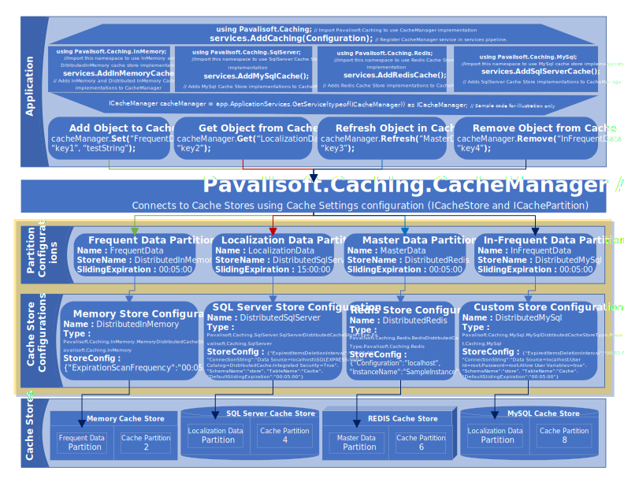

# Caching
Pavalisoft.Caching is an open source caching extension for .NET written in C# to provide sigle unified API for both MemoryCache and DistributedCache implementations. It's additional feature CacheManager supports various cache providers and implements many advanced features which can be used in single project/application.

The main goal of the Pavalisoft.Caching package is to make developer's life easier to handle even very complex caching scenarios and concentrate on functionality.  
With Pavalisoft.Caching, it is possible to implement multiple layers of caching with multiple cache providers in one place, e.g. In-MemoryCache, distributed cache, in just a few lines of code.

## Documentation
 
## Examples

